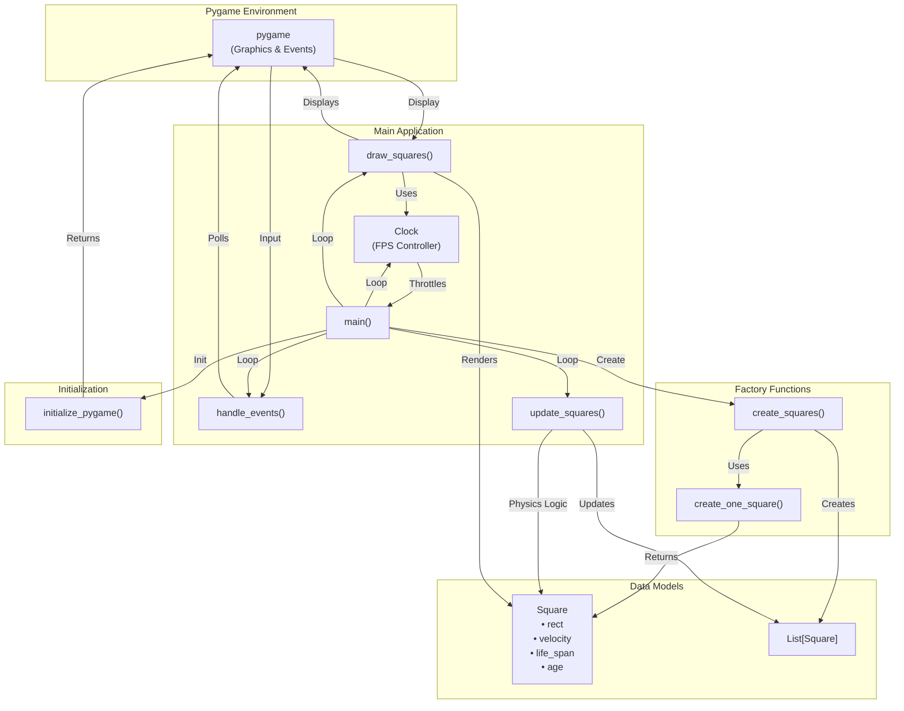
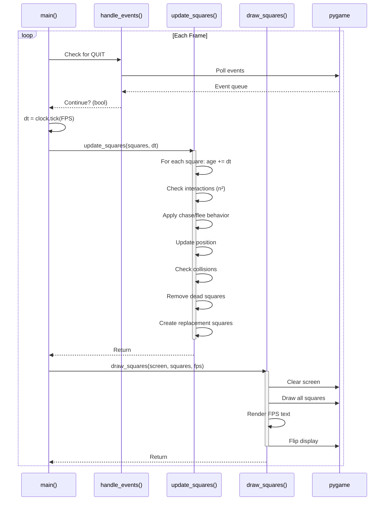
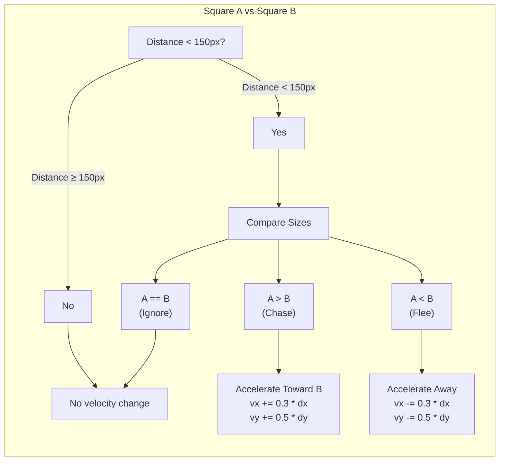

# FLEEEEEEE - Architecture Diagrams

## Project Overview
**FLEEEEEEE** is a Pygame-based interactive animation application that simulates the behavior of autonomous squares on a 2D canvas. The application demonstrates emergent behavior through simple physics-based rules: larger squares chase smaller ones, smaller squares flee from larger ones.

---

## System Architecture Diagram



**Key Components:**
- **Pygame Environment**: Handles graphics rendering and input events
- **Main Application**: Game loop and core logic functions
- **Data Models**: Square dataclass and list management
- **Factory Functions**: Creation and initialization of Square objects
- **Initialization**: Setup and startup functions

---

## Main Loop Sequence Diagram



**Sequence:**
1. **Event Handling**: Check for user input (QUIT event)
2. **Timing**: Throttle to target FPS (50 FPS = ~20ms/frame)
3. **Update**: Apply physics, interactions, and lifecycle management
4. **Render**: Draw all squares and UI elements to screen

---

## Interaction Logic Diagram



**Behavior Rules:**
- **Interaction Radius**: 150 pixels
- **Chase (Larger → Smaller)**: Accelerate toward target at (vx: 0.3, vy: 0.5)
- **Flee (Smaller → Larger)**: Accelerate away from threat at (vx: -0.3, vy: -0.5)
- **Equal Size**: No interaction
- **Distance Threshold**: Interactions only occur within 150 pixels

---

## Configuration Constants

| Constant | Value | Purpose |
|----------|-------|---------|
| `SCREEN_WIDTH` | 500 | Canvas width in pixels |
| `SCREEN_HEIGHT` | 700 | Canvas height in pixels |
| `MIN_SQUARE_SIZE` | 5 | Minimum square dimension |
| `MAX_SQUARE_SIZE` | 50 | Maximum square dimension |
| `SQUARE_COUNT` | 20 | Initial and maintained population |
| `FPS` | 50 | Target frames per second |
| `MIN_LIFE_SPAN` | 3.0 | Minimum lifespan in seconds |
| `MAX_LIFE_SPAN` | 8.0 | Maximum lifespan in seconds |
| `INTERACTION_RADIUS` | 150 | Distance threshold for behavior |

---

## Data Model: Square Dataclass

```python
@dataclass
class Square:
    rect: pygame.Rect              # Position (x, y) and dimensions (width, height)
    velocity: Tuple[float, float]  # (vx, vy) - movement per frame
    life_span: float               # Maximum age in seconds (3-8)
    age: float = 0.0               # Current age, incremented each frame
```

**Lifecycle:**
- Birth: Random position, size (5-50px), velocity (inverse to size), lifespan (3-8s)
- Growth: Age accumulates each frame
- Death: Removed when `age >= life_span`
- Replacement: New square immediately created

---

## Performance Profile

- **Fixed Population**: Always maintains 20 squares
- **Time Complexity**: O(n²) per frame (20² = 400 pairwise checks)
- **Frame Rate**: 50 FPS target (20ms per frame)
- **Memory**: Minimal (~20 Square objects + Pygame surface)

---

## Design Patterns

1. **Dataclass Pattern**: Structured data container for Square entities
2. **Factory Pattern**: `create_one_square()` and `create_squares()` for object creation
3. **Game Loop Pattern**: Classic event → update → render cycle
4. **Collision Handling**: Physics-based boundary reflection with clamping